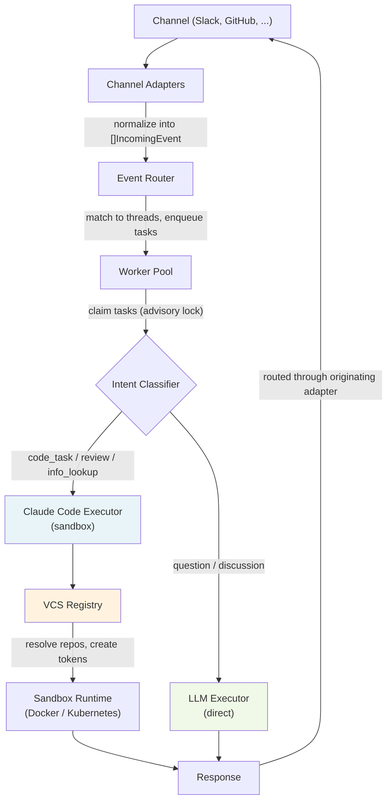
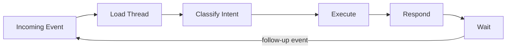

# Architecture

AI Coworker is an event-driven Go service with a thread-based conversation model and a persistent task queue. Pluggable channel adapters normalize incoming events into a common format (currently GitHub and Slack, extensible via the `adapter.Adapter` interface), a worker pool processes them using LLM-based intent classification, and executors (Claude Code in sandboxed containers or direct LLM calls) handle the actual work. A VCS provider abstraction (`vcs.Provider`) decouples repository operations from any specific platform, making it straightforward to add support for GitLab, Bitbucket, or other hosts.

## Event Flow



1. A channel adapter receives an event (webhook, Socket Mode message).
2. It normalizes the event(s) into a batch of `[]IncomingEvent` and publishes them to the router.
3. The router acknowledges all events first (emoji reactions), then looks up or creates a thread by `(channel, thread_key)`.
4. For each event in the batch, a user message is stored and a `pending` task is enqueued.
5. A worker claims a task, loads the full conversation history, and classifies the intent.
6. For review intents, the worker absorbs sibling pending review tasks from the same thread (500ms debounce), merging them into a single structured prompt.
7. The worker delegates to the appropriate executor. The code executor uses the VCS Registry to resolve repository URLs and create scoped access tokens.
8. The result is stored as an assistant message. For batched reviews, the output is parsed into per-comment responses and routed back individually through the originating adapter.
9. The thread stays active, waiting for follow-up events.

## Components

### Channel Adapters

Each adapter implements the `adapter.Adapter` interface (`internal/adapter/adapter.go`):

```go
type EventHandler func(ctx context.Context, events []domain.IncomingEvent) error

type Adapter interface {
    Start(ctx context.Context, handler EventHandler) error
    SendResponse(ctx context.Context, ref domain.ChannelRef, message string) error
    Acknowledge(ctx context.Context, ref domain.ChannelRef) error
    Name() string
}
```

**GitHub Adapter** (`internal/adapter/github/`) — Listens for GitHub App webhook events on `POST /webhook/github` (port 8080). Handles two webhook event types: `IssueCommentEvent` and `PullRequestReviewEvent`. The `PullRequestReviewCommentEvent` webhook is intentionally ignored — inline review comments are fetched via the API within `handlePRReview` to produce a single batch of events and avoid duplicate tasks. Validates webhook signatures, filters by `allowedUsers` configuration, authenticates via GitHub App installation tokens scoped to single repositories, and caches clients per installation ID. Exposes its VCS provider via `VCSProvider()` for registration in the VCS Registry. Reacts with :eyes: to acknowledge receipt.

**Slack Adapter** (`internal/adapter/slack/`) — Connects via Slack Socket Mode (outbound WebSocket, no public URL needed). Triggers on `app_mention` events. When receiving a mention inside an existing thread, fetches full thread history via `GetConversationRepliesContext` and prepends it as a `[Thread context:]` block before the `[Current message:]`, giving downstream components full conversation context for follow-up messages. Responds in-thread and reacts with :eyes: to acknowledge.

Both adapters use typed helpers (`ref.go`) to construct and parse `ChannelRef` values, keeping adapter-specific routing data in the opaque `Properties` map while the domain layer stays adapter-agnostic.

### Event Router

`internal/engine/router.go`

The router is the entry point for all incoming events. It processes events in batches:

1. Acknowledges all events via the originating adapter (e.g. emoji reactions) before inserting anything.
2. Looks up an existing thread by `(channel, thread_key)` or creates a new one. All events in a batch share the same thread.
3. For each event, stores the user message and enqueues a `pending` task with the event metadata.

### Worker Pool

`internal/engine/worker.go`

The worker pool runs configurable goroutines (default: 4) that continuously claim pending tasks from PostgreSQL using `SELECT ... FOR UPDATE` with a `pg_try_advisory_xact_lock` for distributed locking. Each worker:

1. Claims a task (atomically transitions `pending` → `in_progress`).
2. Loads the thread and full message history.
3. Classifies the intent via the `IntentClassifier`.
4. Routes to the code executor or LLM executor.
5. Stores the result and sends the response.

**Review task batching:** When a worker claims a task classified as `review`, it waits briefly (500ms debounce) then calls `ClaimPendingTasks(threadID, workerID)` to absorb all remaining pending review tasks in the same thread. The absorbed tasks are merged into a single structured prompt with `--- COMMENT N ---` sections containing file path and line number context. After execution, the output is parsed by `--- COMMENT N ---` headers and individual responses are routed back to each original comment's channel reference. This avoids spinning up a separate sandbox container for each inline review comment.

**Stale task reaper:** A background goroutine runs every 5 minutes and resets any `in_progress` task whose `updated_at` is older than 1 hour back to `pending`. This recovers orphaned tasks left behind by crashed workers, making them eligible for re-claiming by another worker.

### Intent Classifier

`internal/engine/intent.go`

Uses the LLM to categorize each task into one of:

- **code_task** — code changes, bug fixes, feature implementation
- **review** — PR review feedback that needs to be addressed
- **info_lookup** — requires looking up external information (e.g. a GitHub PR, issue, repository, URL, or project state); includes follow-up questions about external resources mentioned earlier in the conversation
- **question** — answerable from general knowledge or current conversation context, without needing external system lookups
- **discussion** — planning, brainstorming

Short-circuits for review events: if the metadata contains `review_state` or `type=review_comment`, the classifier returns `review` without calling the LLM.

### Executors

**Claude Code Executor** (`internal/executor/claudecode/`) — For code tasks, reviews, and info lookups. Spawns an ephemeral container (Docker or Kubernetes Job, depending on the configured sandbox runtime) with:

- The target repo cloned (with optional branch checkout for PR work)
- Claude Code CLI running with `--dangerously-skip-permissions`
- VCS provider tokens for authenticated git operations (resolved via the VCS Registry)
- LLM provider credentials (Anthropic API key or Vertex AI ADC)
- Resource limits (CPU, memory, timeout)

The executor resolves repositories in three tiers: (1) event metadata from the originating VCS adapter, (2) URLs extracted from message content and thread history, (3) fallback with no repo. For all involved VCS providers, scoped tokens are created and passed as `VCS_CREDENTIAL_URLS` for multi-provider authentication within a single container session. The container is disposed after execution.

**LLM Executor** (`internal/executor/llmexec/`) — For questions and discussions. Calls the LLM provider directly with the full conversation history.

### LLM Providers

`internal/llm/provider.go`

```go
type Provider interface {
    Chat(ctx context.Context, messages []Message) (string, error)
}
```

Two implementations:

- **Anthropic** (`internal/llm/anthropic/`) — Supports both direct Anthropic API (`New()` with API key) and Vertex AI (`NewVertex()` with Google Cloud Application Default Credentials). A single package handles both backends using the `anthropic-sdk-go` library.
- **OpenAI-compatible** (`internal/llm/openai/`) — Any service exposing the OpenAI chat completions endpoint (e.g. vLLM, Red Hat MaaS).

### Sandbox

`internal/sandbox/sandbox.go`

```go
type Runtime interface {
    Exec(ctx context.Context, req ExecRequest) (*ExecResult, error)
}
```

Two runtime implementations:

- **Docker** (`internal/sandbox/docker/`) — Creates ephemeral containers locally. Mounts the prompt as a read-only file at `/tmp/prompt.txt`. Enforces CPU and memory limits. Captures stdout/stderr and force-removes the container after execution. Default for development.
- **Kubernetes** (`internal/sandbox/kubernetes/`) — Creates a Kubernetes Job per task. The prompt is delivered via a ConfigMap mounted at `/tmp/prompt.txt`. Job completion is monitored via the Kubernetes watch API. On completion, pod logs are read for output. Cleanup deletes both the Job (with background propagation) and ConfigMap. Jobs have `backoffLimit: 0` (no retries) and `TTLSecondsAfterFinished: 3600`. Uses `rest.InClusterConfig` and requires RBAC permissions for Jobs, ConfigMaps, and Pods in the configured namespace.

Both runtimes use the same sandbox image (`sandbox/Dockerfile`), based on `node:22-bookworm` with `git`, `gh` (GitHub CLI), and `@anthropic-ai/claude-code` installed. The entrypoint script (`sandbox/entrypoint.sh`) handles VCS credential setup (`VCS_CREDENTIAL_URLS` written to `~/.git-credentials`), GitHub CLI authentication, Google Cloud ADC setup, repo cloning (with `--` separator to prevent flag injection), and Claude Code execution.

### VCS Providers

`internal/vcs/vcs.go`

The VCS provider abstraction decouples repository operations (token creation, clone URLs, credential setup) from any specific platform.

```go
type Provider interface {
    Name() string
    CreateTokenForRepo(ctx context.Context, repo string) (string, error)
    CloneURL(repo string) string
    TokenEnvVar() string
    CredentialURL(token string) string
    ParseRepoFromURL(rawURL string) (repo string, ok bool)
}
```

A `Registry` holds an ordered list of providers and offers:

- `ResolveURL(rawURL)` — tries each provider's `ParseRepoFromURL` and returns the first match.
- `ExtractReposFromText(text)` — finds all URLs in a string and resolves them against registered providers. Used by the Claude Code executor to discover repos from user messages (e.g. when a Slack user pastes a GitHub link).
- `ByName(name)` — looks up a provider by name (e.g. `"github"`).

**GitHub** (`internal/vcs/github/`) — Implements `vcs.Provider` for GitHub. Uses the GitHub App's transport to create installation tokens scoped to a single repository. Caches installation IDs from webhook events and discovers them via the API on demand (with singleflight deduplication).

The registry is wired in `main.go`: when the GitHub adapter is enabled, `githubAdapter.VCSProvider()` is registered. Future VCS backends (GitLab, Bitbucket, etc.) follow the same pattern — implement the `vcs.Provider` interface and register it.

### Store

`internal/store/postgres.go`

PostgreSQL-backed persistence with three core tables:

- **threads** — maps `(channel, thread_key)` pairs to a conversation. Adapter-specific routing data is stored in a JSONB `properties` column.
- **messages** — ordered messages within a thread (user and assistant), with timestamps.
- **tasks** — work queue with status (`pending`, `in_progress`, `completed`, `failed`), worker assignment, JSONB metadata, timestamps, and results.

Key operations:

- `ClaimNextTask` — atomically claims the oldest pending task using `pg_try_advisory_xact_lock` and `FOR UPDATE` to prevent concurrent claims across workers.
- `ClaimPendingTasks` — atomically claims all pending tasks for a given thread, used by the review task batching logic.

Migrations are embedded as SQL files (`internal/store/migrations/`) and applied automatically on startup.

## Thread Model

There is no distinction between "new task" and "follow-up." Every incoming event is matched to a thread by its `(channel, thread_key)` pair. If the thread exists, the event is a continuation with full history. If not, a new thread is created.



Each adapter constructs a unique `ThreadKey` from its own identifiers:

- GitHub: `"org/repo#42"` (repo + issue/PR number)
- Slack: `"C123/1234.5678"` (channel ID + thread timestamp)

## Domain Types

The core types live in `internal/domain/`:

**ChannelRef** — adapter-agnostic reference to a conversation location. `Channel` identifies the adapter, `ThreadKey` is a unique identifier within that channel, and `Properties` is an opaque `map[string]string` for adapter-specific routing data.

**IncomingEvent** — normalized event from any adapter, containing the channel ref, user content, and optional metadata.

**Thread** — a conversation with a status (active, resolved, expired).

**Task** — a unit of work with a status lifecycle: `pending` -> `in_progress` -> `completed` / `failed`.

**Message** — a single message in a thread, either from the user or assistant.

## Project Structure

```
cmd/ai-coworker/              Entry point, wires all components
internal/
  adapter/                    Channel adapter interface
    adapter.go                EventHandler + Adapter interface
    github/                   GitHub App webhook adapter
      github.go               Webhook handling, event parsing, user authz
      github_test.go          Adapter tests
      ref.go                  Typed NewRef/ParseRef helpers
      ref_test.go             Ref tests
    slack/                    Slack Socket Mode adapter
      slack.go                Socket Mode, app_mention, thread context
      slack_test.go           Adapter tests
      ref.go                  Typed NewRef/ParseRef helpers
      ref_test.go             Ref tests
  config/                     Configuration loading (koanf, YAML + env vars)
    config.go                 Config struct, Load(), env var mapping
    config_test.go            Config tests
  domain/                     Core types (Event, Thread, Task, Message, ChannelRef)
  engine/                     Core orchestration
    router.go                 Event -> thread matching -> task dispatch (batch)
    router_test.go            Router tests
    worker.go                 Worker pool, task claiming, review batching
    worker_test.go            Worker tests
    intent.go                 LLM-based intent classification (5 intents)
    intent_test.go            Intent classifier tests
  executor/                   Task execution
    executor.go               Executor interface
    claudecode/               Sandbox executor (Docker/K8s + Claude Code CLI)
      claudecode.go           VCS resolution, prompt building, sandbox exec
      claudecode_test.go      Executor tests
    llmexec/                  Direct LLM executor (Q&A, discussions)
      llmexec.go              Conversation history + LLM call
  llm/                        LLM provider interface
    provider.go               Provider interface definition
    anthropic/                Anthropic Claude API (direct + Vertex AI)
      anthropic.go            New() for API key, NewVertex() for ADC
      anthropic_test.go       Provider tests
    openai/                   OpenAI-compatible API
      openai.go               Chat completions client
      openai_test.go          Provider tests
  sandbox/                    Sandbox runtime interface
    sandbox.go                Runtime interface definition
    docker/                   Docker container runtime
      docker.go               Container create, exec, log capture, cleanup
      docker_test.go          Runtime tests
    kubernetes/               Kubernetes Job runtime
      kubernetes.go           Job + ConfigMap create, watch, log read, cleanup
      kubernetes_test.go      Runtime tests
  store/                      Data store interface + PostgreSQL implementation
    store.go                  Store interface (incl. ClaimPendingTasks)
    postgres.go               PostgreSQL implementation
    postgres_test.go          Store tests
    metadata_test.go          Metadata JSONB tests
    migrations/               Embedded SQL migration files
  vcs/                        VCS provider abstraction
    vcs.go                    Provider interface + Registry
    vcs_test.go               Registry tests
    github/                   GitHub VCS provider
      github.go               Token creation, clone URLs, repo resolution
      github_test.go          Provider tests
sandbox/                      Sandbox container image
  Dockerfile                  Node 22 + git + gh + Claude Code CLI
  entrypoint.sh               VCS creds, ADC, repo clone, Claude Code exec
deploy/kubernetes/            Kustomize manifests for Kubernetes deployment
  base/                       Base manifests (Deployment, Service, RBAC, config)
  components/postgres/        Kustomize component: PostgreSQL Deployment
  components/google-adc/      Kustomize component: Google ADC for Vertex AI
  overlays/with-postgres/     Overlay: base + postgres
  overlays/kind/              Overlay: base + postgres + google-adc (local testing)
hack/                         Developer scripts
  kind.sh                     KinD cluster lifecycle for local e2e testing
```
